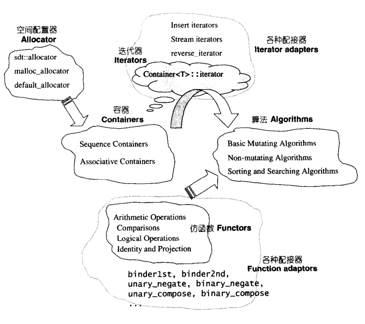

#### STL概论

###### STL的诞生

为了建立数据结构和算法的一套标准，并且降低其间的耦合（coupling）关系以提升各自的独立性、弹性、交互操作性（相互合作性，interoperability），c++社群里诞生了STL。

###### STL的价值

1. STL 给我们一套极具实用价值的零部件，以及一个整合的组织。
2. STL 还给我们一个高层次的、以泛型思维（Generic Paradigm）为基础的、系统化的、条理分明的 ”软件组件分类学（components taxonomy）“
3. STL 创新价值在于具体叙述了上述这些抽象概念，并加以系统化。

###### STL的历史

 STL由 Alexander Stepanov 创造于1979年前后，1993年Waterloo（滑铁卢）会议开幕前完成正式提案，成为C++标准。

###### STL与c++标准程序库

1994年3月圣地亚哥会议，STL在会议上获得了很好的回响，1998年9月成为c++标准规格中的c++标准程序库的一大脉系

#### STL的六大组件 功能与运用

1. 容器（containers）：各种数据结构，如 vector，list，deque，set，map，用来存放数据，是一种 class template。
2. 算法（algorithms）：各种常用算法如 sort，search，copy，erase...。是一种 function template。
3. 迭代器（iterators）：扮演容器与算法之间的胶合剂，是所谓的“泛型指针”。是一种将 operator*，operator->，operator++，operator--等指针相关操作予与重载的 class template。
4. 仿函数（functors）：行为类似还是，可作为算法的某种策略（policy）。是一种重载了 operator()的class 或 class template。
5. 配接器（adapters）：一种用来修饰容器或仿函数或迭代器接口的东西。例如，STL提供的queue和stack虽然看似容器，其实只能算是一种容器配接器，因为它们的底部完全借助 deque。改变 functor接口者，称为 function adapter；改变 container 接口者，称为 container adapter。
6. 配置器（allocators）：负责空间配置与管理。是一个实现了动态空间配置、空间管理、空间释放的 class template。

STL 六大组件的交互关系

