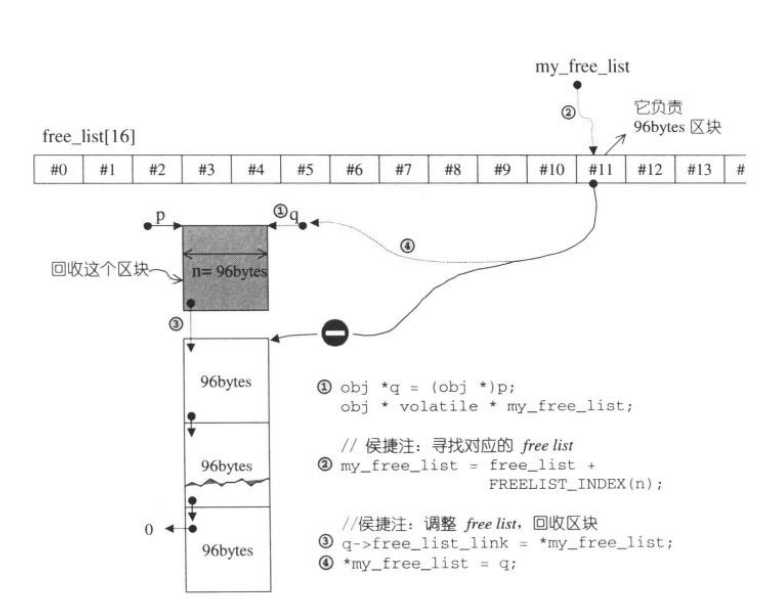

 
#### 空间配置器

##### 空间配置器的标准接口

要实现一个alloc 要实现下面接口

- allocator::value_type
- allocator::pointer
- allocator::const_pointer
- allocator::reference
- allocator::const_reference
- allocator::size_type
- allocator::difference_type
- allocator::rebind
  > 一个嵌套的(nested) class template。class rebind<U> 拥有唯一成员 other， 那是一个 typedef，代表 allocator<U>。
- allocator::allocator
  > default constructor
- allocator::allocator(const allocator &) 
  > copy constructor
- template <class U> allocator::allocator(const allocator<U> &)
  > 泛化的 copy constructor

- allocator::~allocator()
  > default alloactor

- pointer allocator::address(reference x) const
  > 返回某个对象的地址。算式 a.address(x) 等同于 &x

- const_pointer allocator::address(const_reference x) const
  > 返回摸个 const 对象的地址。算式 a.address(x) 等同于 &x

- pointer allocator::allocate(size_type n, const void* = 0)
  > 配置空间，足以存储n个T对象，第二个参数是个提示，实现上可能会利用它来增进区域性（locality），或完全忽略之

- void allocator::deallocate(pointer p, size_type n)
  > 归还先前配置的空间
  
- size_type allocatot::max_size() const
  > 返回可成功配置的最大量
- void allocator::construct(pointer p, const T& x)
  > 等同于 new(const void*) p ) T(x)
- void allocator::destroy(pointer p)
  > 等同于 p->~T()


一个标准的allocator接口如下：

```c++
template <class U>
class allocator {
typedef alloc _Alloc;          // The underlying allocator.
public:
typedef size_t     size_type;
typedef ptrdiff_t  difference_type;
typedef U*       pointer;
typedef const U* const_pointer;
typedef U&       reference;
typedef const U& const_reference;
typedef U        value_type;

template <class U> struct rebind {
typedef allocator<U> other;
};

allocator() {}
allocator(const allocator&) {}
template <class U> allocator(const allocator<U>&) {}
~allocator() {}

pointer address(reference __x) const { return &__x; }
const_pointer address(const_reference __x) const { return &__x; }

// __n is permitted to be 0.  The C++ standard says nothing about what
// the return value is when __n == 0.
U* allocate(size_type __n, const void* = 0);
// __p is not permitted to be a null pointer.
void deallocate(pointer __p, size_type __n)
{ _Alloc::deallocate(__p, __n * sizeof(U)); }

size_type max_size() const;

void construct(pointer __p, const U& __val);
void destroy(pointer __p);
};
```

##### 具备次配置力（sub-allocation）的SGI空间配置器

SGI也有定义标准的名为alloactor的配置器，但SGI从未用过它， 也不建议使用，主要是效率不佳，只是把 ::operator new 和 ::operator delete  做一层薄薄的包装而已。
代码在 defalloc.h

###### SGI特殊的空间配置器，std::alloc

SGI allocator 将new 操作的内存配置和对象构造区分开来，内存配置操作由alloc::allocate()负责，内存释放操作由 alloc::deallocate() 负责；
对象构造由 ::construct()负责，对象析构由 ::destroy()负责。

配置器定义于 <memory>中包含两个文件:
- 内存配置操作在 `#include<stl_alloc.h>` 文件 
- 对象构造析构在 `#include<stl_construct.h>`文件


SGI的内存配置操作分为两级，第一级是直接使用 malloc() 和 free()，第二级配置器使用内存池策略，当配置区块超过128bytes时，视之为“足够大”，调用一级配置器，
小于128bytes时，使用内存池：

SGI 内存池，每次配置一大块内存，并维护对应之自由链表（free-list），为了方便管理，第二级配置器会主动将任何小额区块的内存需求上调至8的倍数,
并维护16个自由链表（128/8=16）各自管理8,16,24,32,40,48,56，64，72,80,88,96,104,112,120,128bytes的小额区块，free-lists的节点结构如下：

```c++
union {
    union obj * free_list_link;
    char client_data[1];
}
```
自由链表实现技巧


空间配置 allocate() 操作实现

```c++
  /* __n must be > 0      */
  static void* allocate(size_t __n)
  {
    void* __ret = 0;

    // 大于128字节 走一级配置器
    if (__n > (size_t) _MAX_BYTES) {
      __ret = malloc_alloc::allocate(__n);
    }
    else {
      // 找到对应16个链表位置
      _Obj* __STL_VOLATILE* __my_free_list
          = _S_free_list + _S_freelist_index(__n);
      _Obj* __RESTRICT __result = *__my_free_list;
      if (__result == 0)
          // 没有找到可用的free list 准备重新填充free list
        __ret = _S_refill(_S_round_up(__n));
      else {
          // 调整free list
        *__my_free_list = __result -> _M_free_list_link;
        __ret = __result;
      }
    }

    return __ret;
  };
```


空间配置 deallocate() 操作实现

```c++
  static void deallocate(void* __p, size_t __n)
  {
      // 大于128调用第一级配置器
    if (__n > (size_t) _MAX_BYTES)
      malloc_alloc::deallocate(__p, __n);
    else {
        // 找到对应的free list
      _Obj* __STL_VOLATILE*  __my_free_list
          = _S_free_list + _S_freelist_index(__n);
      _Obj* __q = (_Obj*)__p;
      // 调整free list 回收区块
      __q -> _M_free_list_link = *__my_free_list;
      *__my_free_list = __q;
      // lock is released here
    }
  }
```



填充free list（空间扩容）操作实现：

当没有free list区块可用时候，会申请创建新的区块，默认创建参数是20个，如果内存池空间不够，可能小于20


`_S_chunk_alloc` 为内存池分配连续的大块空间，for语句里将这个大块空间分为一个个free list区块连接起来。

```c++
template <bool __threads, int __inst>
void*
__default_alloc_template<__threads, __inst>::_S_refill(size_t __n)
{
    int __nobjs = 20;
    char* __chunk = _S_chunk_alloc(__n, __nobjs);
    _Obj* __STL_VOLATILE* __my_free_list;
    _Obj* __result;
    _Obj* __current_obj;
    _Obj* __next_obj;
    int __i;

    if (1 == __nobjs) return(__chunk);
    __my_free_list = _S_free_list + _S_freelist_index(__n);

    // 调整free list 纳入新节点
    /* Build free list in chunk */
    // 返回客户端的节点
      __result = (_Obj*)__chunk;
      *__my_free_list = __next_obj = (_Obj*)(__chunk + __n);
      // 将free list 的各个节点串接起来
      for (__i = 1; ; __i++) {
        __current_obj = __next_obj;
        __next_obj = (_Obj*)((char*)__next_obj + __n);
        if (__nobjs - 1 == __i) {
            __current_obj -> _M_free_list_link = 0;
            break;
        } else {
            __current_obj -> _M_free_list_link = __next_obj;
        }
      }
    return(__result);
}
```

内存池的操作逻辑如下图：
