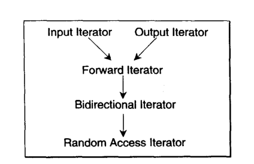

##### 迭代器

迭代器的五种型别

```c++
template <class I>
struct iterator_traits {
  typedef typename I::iterator_category iterator_category;
  typedef typename I::value_type        value_type;
  typedef typename I::difference_type   difference_type;
  typedef typename I::pointer           pointer;
  typedef typename I::reference         reference;
};

// 对原生指针的偏特化
template <class T>
struct iterator_traits<T*> {
  typedef typename T::iterator_category iterator_category;
  typedef typename T::value_type        value_type;
  typedef typename T::difference_type   difference_type;
  typedef typename T::pointer           pointer;
  typedef typename T::reference         reference;
};

// 对原生指针的pointer-to-const的偏特化版本
template <class T>
struct iterator_traits<const T*> {
  typedef typename T::iterator_category iterator_category;
  typedef typename T::value_type        value_type;
  typedef typename T::difference_type   difference_type;
  typedef typename T::pointer           pointer;
  typedef typename T::reference         reference;
};

```

1. value_type
指的是迭代器所指对象的型别。
2. difference_type
用来表示两个迭代器之间的距离，因此也可以用来表示一个容器的最大容量
3. reference
表示返回迭代器所指对象的引用
4. pointer
返回迭代器所指对象的指针地址类型
5. iterator_category
返回迭代器的分类类型

迭代器的分类，分为5类：
1. input Iterator:这种迭代器所指的对象，不允许外界改变。只读(read only)。
2. Output Iterator:唯写( write only)。
3. Forward Hterator:允许“写人型” 算法(例如replace())在此种迭代器所形成的区间上进行读写操作。
4. Bidirectional Hterator:可双向移动。某些算法需要逆向走访某个迭代器区间(例如逆向拷贝某范围内的元素)。
5. Random Access Iterator: 前四种迭代器都只供应-部分指针算术能力(前三种支持 operator++，第四种再加上operator--) ，第五种则涵盖所有指针，包括算术能力，包括p+n, p-n, p[n]，p1-p2, p1<p2。

迭代器的分类与从属关系：



STL算法命名规则：以算法所能接受之最初级类型来为其迭代器型别参数命名。